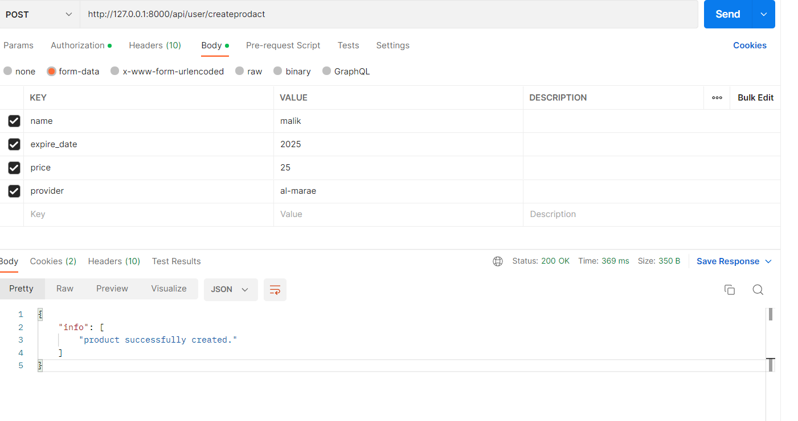
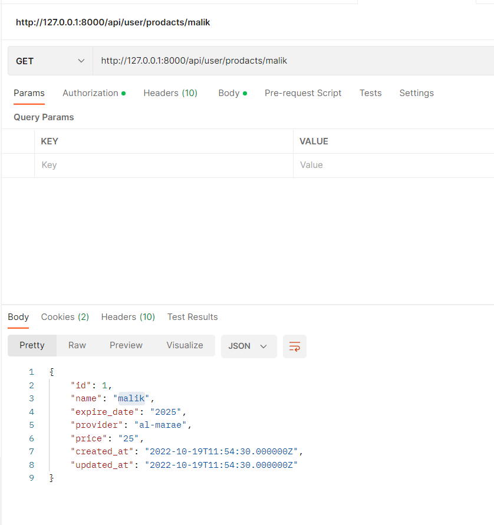
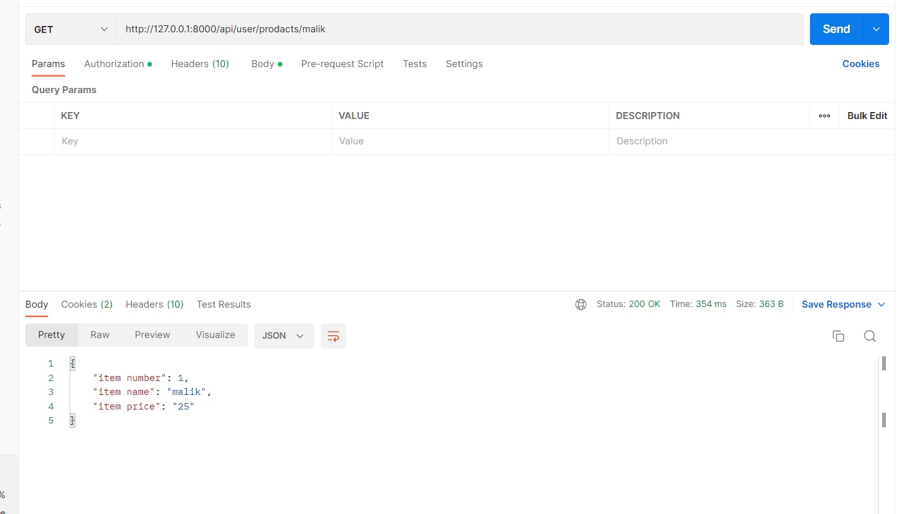

# multi authentication api

multi authentication api using:
1. passport authentication
2. multi guard authentication
3. resources

----------------------------------------------------------------
## user registration
- it register user after validation

- if user is not registered, it will register

- if user  registered , so the user can login to get the __token__

- after login the user can access to dashboard using the token that take from login

- add products

- find product by name __without resources__

- find product by name __with resources__

[ref1](https://www.mywebtuts.com/blog/how-to-use-multi-authentication-api-using-laravel-9)
[ref2](https://stackoverflow.com/questions/58644716/laravel-and-passport-getting-sqlstate42s22-column-not-found-1054-unknown-col)
[ref3](https://stackoverflow.com/questions/48715076/laravel-5-5-scopes-definition)